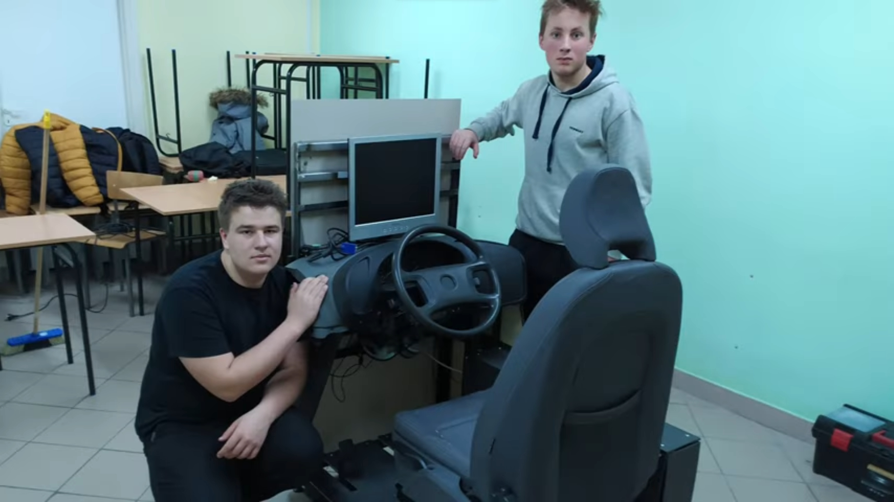

# Projekt Ekonomik Roadster

### Ekonomik Roadster został przygotowany na potrzeby konkursu "Od pomysłu do przemysłu".  Jego autorami są: Jakub Frączek oraz Kamil Kras.
###Projekt można zobaczyć tutaj: https://www.youtube.com/watch?v=ISzCpdcXRQk
# KONFIGURACJA PROGRAMU
   1. Pobrać następujące biblioteki:
   - https://github.com/MHeironimus/ArduinoJoystickLibrary
   - https://github.com/PaulStoffregen/Encoder
   - https://github.com/dmadison/ArduinoXInput
   2. Przenieść i rozpakować pobrane biblioteki do dokumenty/arduino/libraries
   3. Pobrać najnowsze wydanie: https://github.com/dmadison/ArduinoXInput_AVR
   4. Odnaleźć miejsce na dysku w którym zainstalowane jest Arduino IDE,
   przykładowo: D:\Arduino\
   5. Do folderu D:\Arduino\hardware przenieść i rozpakować pobrany plik
    
### JOYSTICK
   - W celu użycia arduino jako zwykłego kontrolera, należy odkomentować #define JOY
   oraz zakomentować #define XBOX oraz wybrać Arduino z AVR Boards, nie trzeba wybierać portu.
   Gdy pokaże się "Uploading..." dwa razy szybko kliknąć guzik reset na arduino, dioda
   z podpisem L powinna zacząć migać. 
   
### XBOX 360 GAMEPAD
   - W celu użycia arduino jako pada od xboxa 360 należy odkomentować #define XBOX
   oraz zakomentować #define JOY oraz wybrać Arduino Leonardo z XInput AVR Boards, 
   nie trzeba wybierać portu. Gdy pokaże się "Uploading..." dwa razy szybko kliknąć 
   guzik reset na arduino, dioda z podpisem L powinna zacząć migać. 
  
